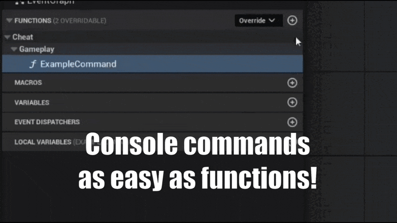  

# About

An Unreal Engine plugin that provides an easy way to implement console commands in blueprints through custom `CheatManager` and `CheatManagerExtension` classes

if you like the plugin and want to support & encourage me you can [buy me a coffee](https://ko-fi.com/sleepcow1) or purchase `Professional` license on Fab `LINK` (NOTE: Fab version is distributed with Fab Standart license!)

# Features

- **Easy**: derive from `CowCheatManager` and add functions under "Cheat" category (can be changed via `CheatCategoryPrefix`), all in Blueprints.
- **Auto-complete**:
    - All commands within active cheat manager is autoregistered and added to Unreal`s console
    - Function `Description` is used as a console command help
    - All arguments automatically added to help
    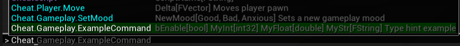
    - Support of Enums (both Blueprints and C++), primitive types, GameplayTags, Structures (however structs have very inconvinient syntax for console usage, e.g. `FVector` parameter should be passed as `(x=1.5,y=2.6,z=3.7)`, no spaces allowed, all members must be named explicitly so I recommend avoid using structs as console command parameters)
  
- **Custom colors**: Color of console commands can be changed in `Blueprint Console Commands Settings` via `MainCheatColor` or by using `OverrideCheatColor` in `CowCheatManagerExtension` if you want extension to have a specific color coding.
- **Modular**: exposed `CowCheatManagerExtension` for modular console commands, add with `AddCheatManagerExtensionClass`. The `Cheat` prefix can be changed via `CheatCategoryPrefix`.
- **Data Validation**: Warnings when console commands has no description (can be disabled via `bDisableMissingDescriptionWarnings`) and validation for conflicting names with existing console commands.
- **Cpp Support**: CheatManager's console commands can be added directly in code, so designers and programmers don't kill each other :P
  ```c++
    // Command description is here
    UFUNCTION(Category = "Cheat|Gameplay")
    void CppCommand(float MyFloat);
  ```
  However note that if you want to use C++ only `CowCheatManager` or `CowCheatManagerExtension` you'll still need to create an empty Blueprint class derived from them and use/add that one to your game. That's limitation is implied because reflection information required for auto-complete is available only in the editor build and that data is being serialized/baked into the asset. Native C++ classes don't do that naturally.

# How to

## Getting started

You should know how to do it but if for whatever reason you dont, you can use following options:
- Download via `Fab` (for precompiled binaries, most suitable if you have Blueprints only project), [Unreal Engine Plugin documentation if you need info on how to enable the plugin](https://dev.epicgames.com/documentation/en-us/unreal-engine/working-with-plugins-in-unreal-engine)
- Download source into `ProjectName/Plugins/BlueprintConsoleCommands` and build the project.

## How to create a console command

1. Go to `Content Browser`
2. Create a `Blueprint Class`
3. Select `CowCheatManager` as parent class 

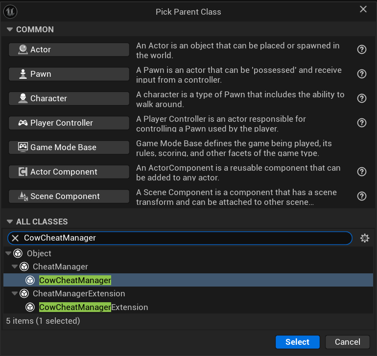

4. Rename it to something useful `BP_CheatManager` or `BP_MainCheatManager` are good starting points

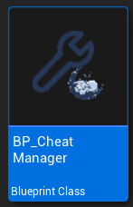

5. Open it and read introduction comment (can be disabled via `bCreateDefaultConsoleCommands`)
6. Add a new function 

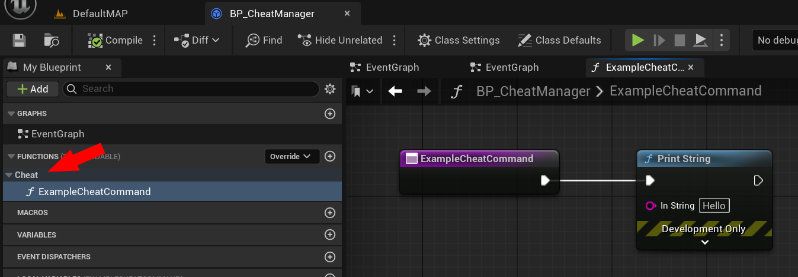

7. For function to be treated as a console command you need to place it under `Cheat` category (Can be changed via `CheatCategoryPrefix`).
For nested categories use `|` e.g. `Cheat|Gameplay` in that case command should be invoked as `Cheat.Gameplay.FunctionName`
Function's description is used in auto-complete, don't ignore it and describe your command! (but if warnings are annoying can be disabled via `bDisableMissingDescriptionWarnings`)

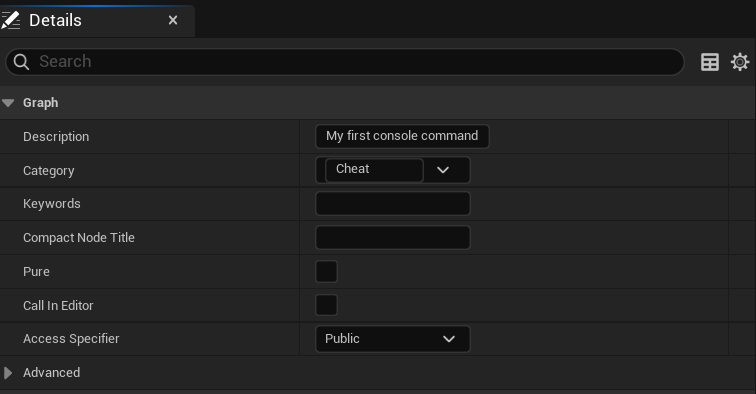

8. Go to your `PlayerController` and select newly created `CheatManager` as `CheatClass`

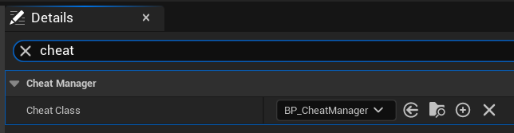

9. Start the game, open console and execute `Cheat.ExampleCommand`, you should see auto-complete in action and `Hello` as the result of `PrintString` node

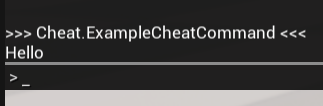

## How to use cheat manager extensions

1. Create new blueprint derived from `CowCheatManagerExtension`
2. Add commands as in regular `CowCheatManager` (see above)
3. Optionally change color of auto-complete for commands defined in that extension `OverrideCheatColor`
4. In appropriate place (preferrably your modular feature/core initialization) get your `PlayerController` and `AddCheatManagerExtensionClass`

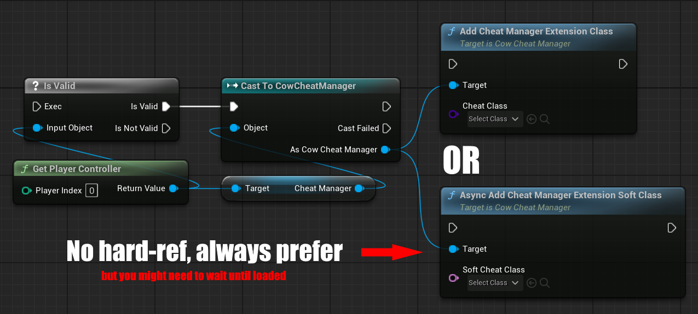

5. When extension no longer needed, remove from cheat manager

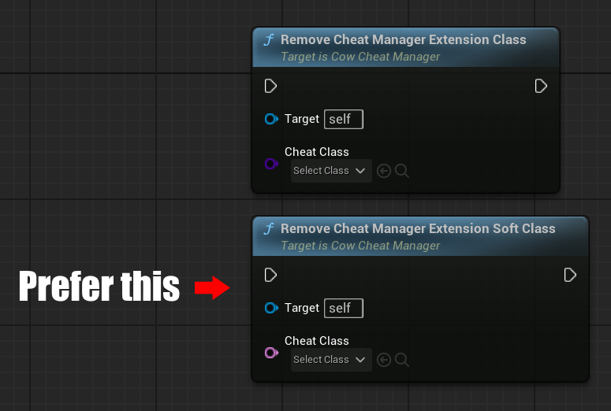

## Settings

Project-wide settings could be found in `Project Settings` -> `Editor` -> `Blueprint Console Commands Settings`

- `CheatCategoryPrefix` -  essential to ensure that internal helper functions within the cheat manager are not exposed as public console commands. By using the project name as the primary category prefix, it helps in clearly distinguishing the project-specific console commands from the default ones provided by the engine. All console commands created in this project must start with this prefix. Additional sub-categories can be structured like "CheatCategoryPrefix.Gameplay.Stealth" to organize commands further under the main category.
- `MainCheatColor` - Color that will be used for commands autocomplete in console. `CowCheatManagerExtension` can override the color, so different modules have unique color it can be disabled by switching `bForceCheatExtensionsUseMainColor` to true.
- `bForceCheatExtensionsUseMainColor` - If true `CowCheatManagerExtension` will use color defined by MainCheatColor instead of their override.
- `bDisableMissingDescriptionWarnings` - If true Validation won't cry about missing comments for console commands but I beg you to spend additional 5 minutes to think about descriptive comment :pray:
- `bCreateDefaultConsoleCommands` - Whether to create default template console commands in newly created `CowCheatManager`/`CowCheatManagerExtension`. Helpful for beginners, might be redundant for somebody who get used to the plugin

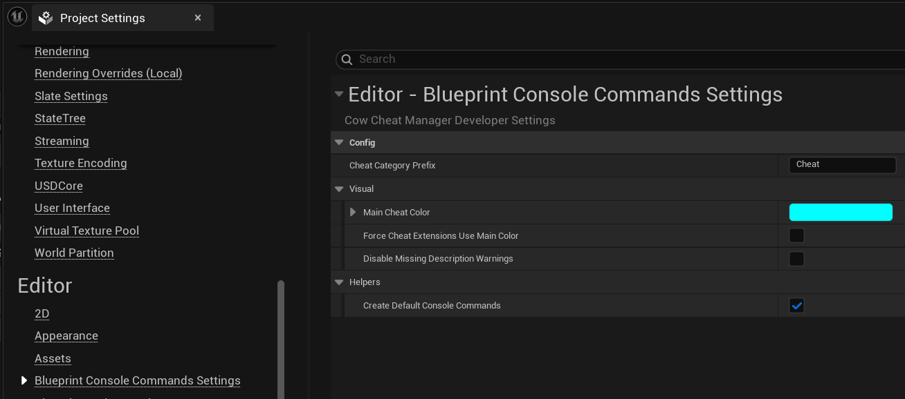
